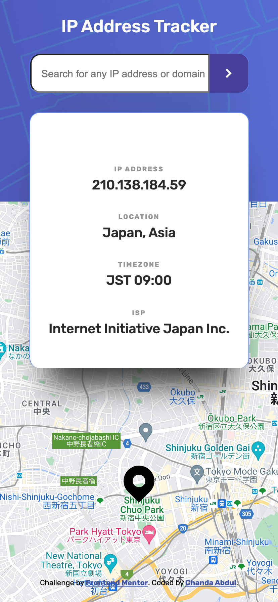
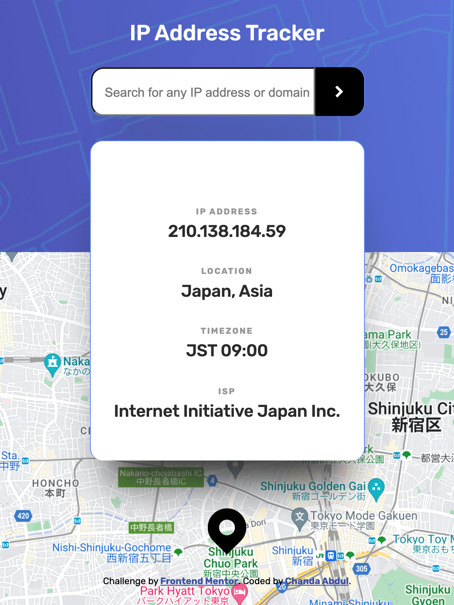
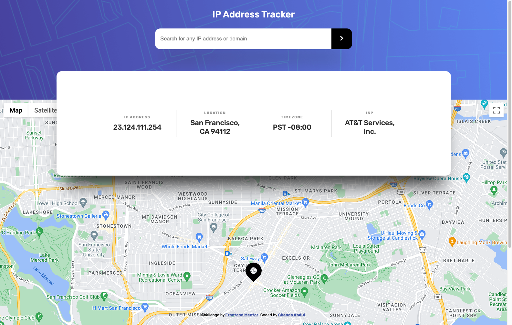

# Frontend Mentor - IP address tracker


This is a solution to the [IP address tracker challenge on Frontend Mentor](https://www.frontendmentor.io/challenges/ip-address-tracker-I8-0yYAH0). Frontend Mentor challenges help you improve your coding skills by building realistic projects. 

## Table of contents

- [Overview](#overview)
  - [The challenge](#the-challenge)
  - [Screenshot](#screenshot)
  - [Links](#links)
- [My process](#my-process)
  - [Built with](#built-with)
  - [What I learned](#what-i-learned)
  - [Continued development](#continued-development)
  - [Useful resources](#useful-resources)
- [Author](#author)
- [Acknowledgments](#acknowledgments)


# Overview

## The challenge

Your challenge is to build out this IP Address Tracker app and get it looking as close to the design as possible. 
* <s>To get the IP Address locations, you'll be using the [IP Geolocation API by IPify](https://geo.ipify.org/). 
* To generate the map, we recommend using [LeafletJS](https://leafletjs.com/).</s>


---
Users should be able to:

- [x] View the optimal layout for each page depending on their device's screen size
  - [x] Mobile: 375px
  - [x] Desktop: 1440px
- [x] See hover states for all interactive elements on the page
- [x] See their own IP address on the map on the initial page load
- [ ] Search for any IP addresses or <s>domains</s> and see the key information and location
<hr>

#### In Progress...
  - [ ] <i>fetch new data with ip address input
  - [ ] create observable/Subject from fetch service for latitude
  - [ ] create observable/Subject from fetch service for longitude
  - [ ] handle errors
  - [ ] remove map controls and fix pin/marker
  - [ ] Add alert styling library for error alerts 
  - [ ] Add Animations?
  - [ ] polish and test your code
  - [ ] implement domain functionality, may need to use a different API?</i>


<!--   -->
<!--  -->
<!--  -->
<!---->
<!--   -->
 <!-- -->
<!--  -->


## Screenshot

#### Mobile `@375px`



#### No one asked but, Tablet @768px



#### Desktop @1140px



#### Input
##### with valid IP address input
##### without valid IP address input
##### with valid domain input

## Links

- Solution URL: [Add solution URL here](https://your-solution-url.com)
- Live Site URL: [Add live site URL here](https://your-live-site-url.com)

## My process
### design
### API Selection
#### Geolocation API
To get the IP Address locations,  I decided to go with the <b>[IP geolocation API by Abstract](https://app.abstractapi.com/api/ip-geolocation/documentation)</b> because the
[IP Geolocation API by IPify](https://geo.ipify.org/docs) had a very small lifetime limit of 1,000 🆓 requests; compared to Abstract's 22,000 🆓 requests per month *and* optional ip address query parameter.
#### Google Maps API
For the mapping API, I went with <b>[Maps JavaScript API](https://developers.google.com/maps/documentation/javascript)</b>, for the mapping API. I've used [LeafletJS](https://leafletjs.com/) before and I wanted to try something new, I thought that a google API would pair well with Angular.
### Reactive Development with RxJs

## Built with
### APIs

- <b>[IP geolocation API by Abstract](https://app.abstractapi.com/api/ip-geolocation/documentation)</b> to get the IP Address locations.
-  For the mapping API, I went with <b>[Maps JavaScript API](https://developers.google.com/maps/documentation/javascript)</b>.
- <b>[Insomnia](https://insomnia.rest/)</b> to test API endpoints and query parameters.

### Frameworks and Librarys
- <b>[Angular](https://angular.io/)</b> (<b>JavaScript</b> framework)
  - <b>[TypeScript](https://www.typescriptlang.org/)</b>
  - <b>[JavaScript](https://www.javascript.com/)</b>
  - <b>[RxJs](https://rxjs.dev/)</b> a library for reactive programming using Observables.
- <b>[Figma](https://www.figma.com/)</b> collaborative web application for interface design.
- <b>[Sass](https://sass-lang.com/)/CSS</b> custom properties
  - Mobile-first workflow
  - Responsive Styling
  - Flexbox
- Semantic <b>HTML5</b> markup

## What I learned

<!-- Use this section to recap over some of your major learnings while working through this project. Writing these out and providing code samples of areas you want to highlight is a great way to reinforce your own knowledge.

To see how you can add code snippets, see below:

```html
<h1>Some HTML code I'm proud of</h1>
```
```css
.proud-of-this-css {
  color: papayawhip;
}
```
```js
const proudOfThisFunc = () => {
  console.log('🎉')
}
``` -->


## Continued development
- [ ] search by domain input 
- [ ] add animations

## Useful resources

- [Get data from a server](https://angular.io/tutorial/toh-pt6) - This is an amazing article which helped me finally understand XYZ. I'd recommend it to anyone still learning this concept.
- [Integrating Google Maps API w/ Angular 7+](https://medium.com/@jkeung/integrating-google-maps-api-w-angular-7-e7672396ce2d) - This helped me for XYZ reason. I really liked this pattern and will use it going forward.
- [How to Display Spinner...](https://www.geeksforgeeks.org/how-to-display-spinner-on-the-screen-till-the-data-from-the-api-loads-using-angular-8/) - This is an amazing article which helped me finally understand XYZ. I'd recommend it to anyone still learning this concept.

- [fdhjklkdaf](#) - This helped me for XYZ reason. I really liked this pattern and will use it going forward.
- [fdhjklkdaf](#) - This is an amazing article which helped me finally understand XYZ. I'd recommend it to anyone still learning this concept.
- [fdhjklkdaf](#) - This helped me for XYZ reason. I really liked this pattern and will use it going forward.

## Author

- Frontend Mentor - [@Chanda-Abdul](https://www.frontendmentor.io/profile/Chanda-Abdul)
- Website - [Chanda Codes](https://chandacodes.com/)
- GitHub - [github.com/Chanda-Abdul](https://github.com/Chanda-Abdul)

## Acknowledgments

<!-- This is where you can give a hat tip to anyone who helped you out on this project. Perhaps you worked in a team or got some inspiration from someone else's solution. This is the perfect place to give them some credit. -->


