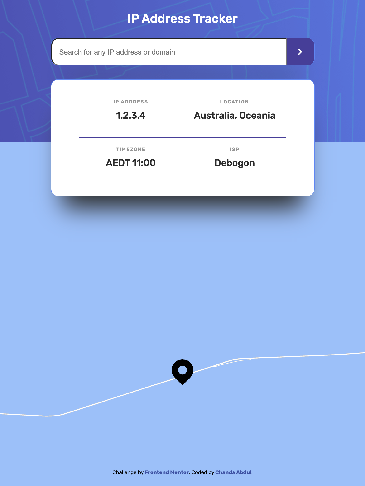
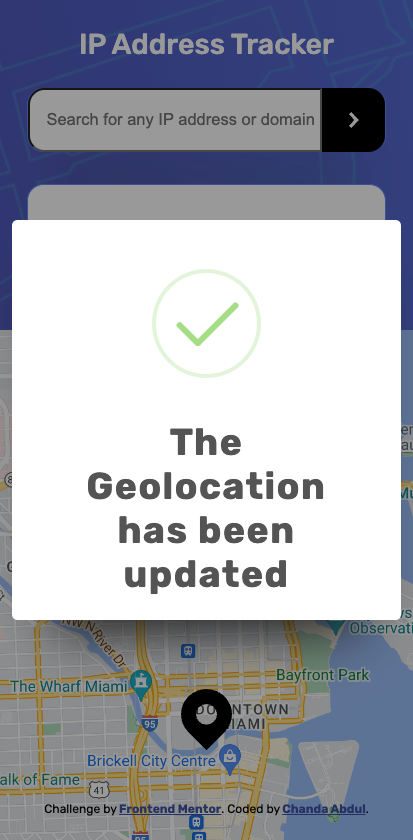
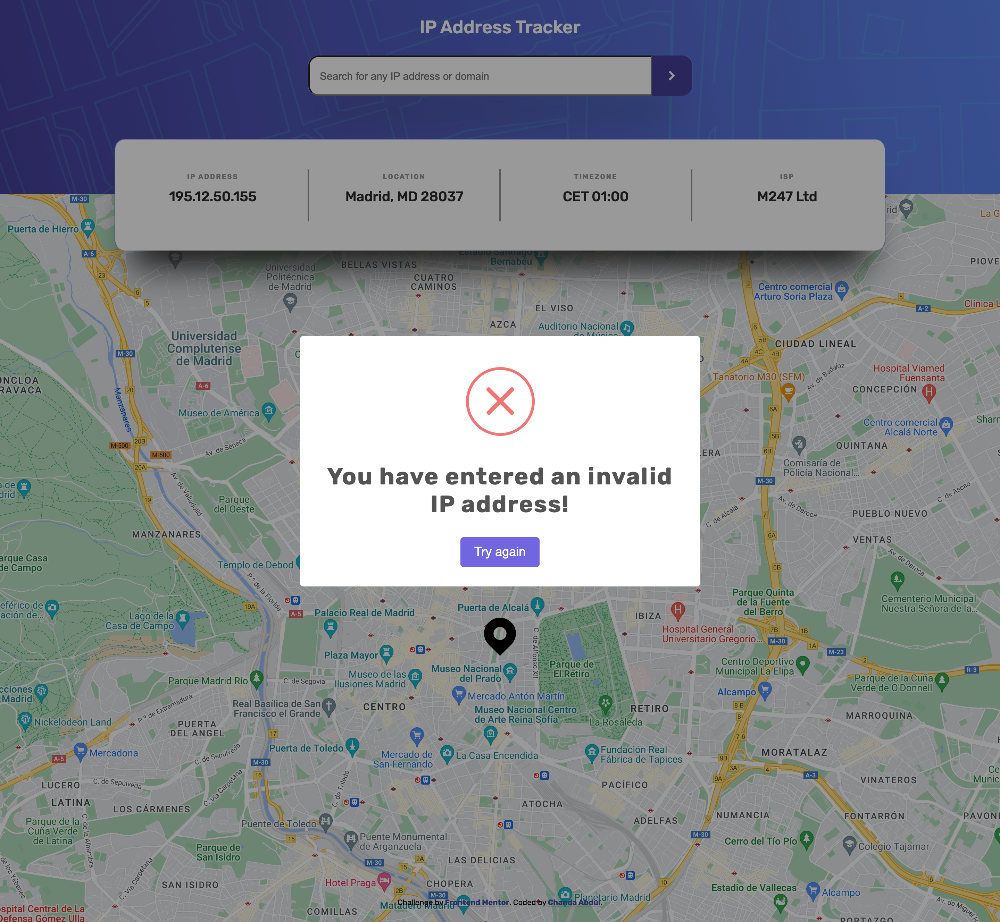
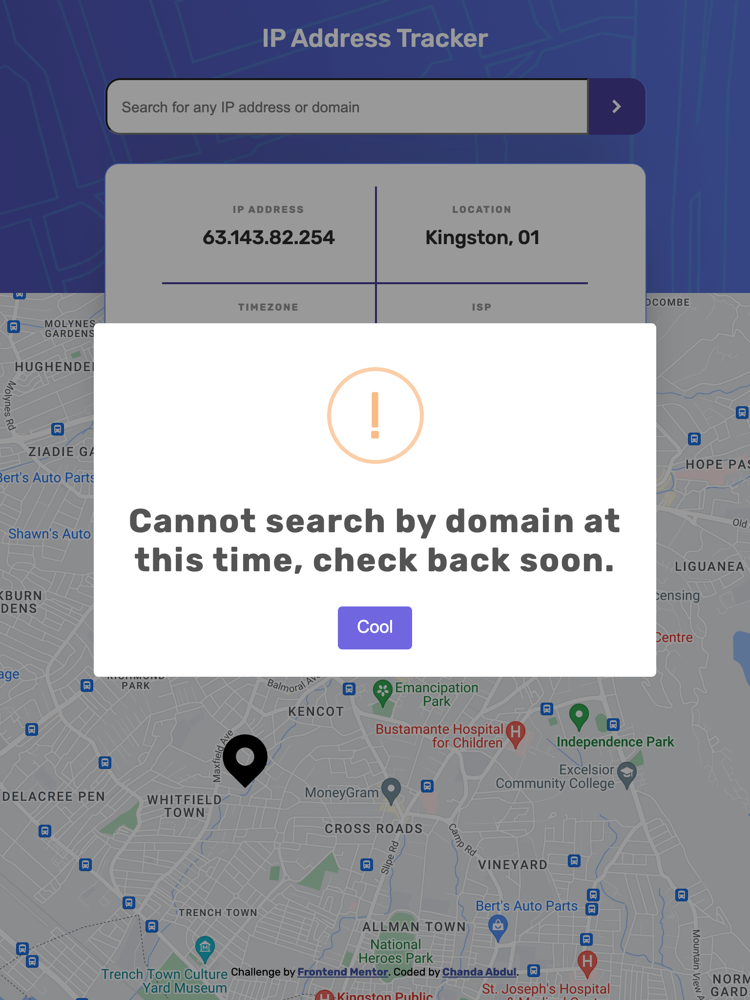

# Frontend Mentor - IP address tracker


This is a solution to the [IP address tracker challenge on Frontend Mentor](https://www.frontendmentor.io/challenges/ip-address-tracker-I8-0yYAH0). Frontend Mentor challenges help you improve your coding skills by building realistic projects. 

## Table of contents

- [Overview](#overview)
  - [The challenge](#the-challenge)
  - [Screenshots](#screenshots)
  - [Links](#links)
- [My process](#my-process)
  - [Built with](#built-with)
  - [What I learned](#what-i-learned)
  - [Continued development](#continued-development)
  - [Useful resources](#useful-resources)
- [Author](#author)
- [Acknowledgments](#acknowledgments)


# Overview

## The challenge

Your challenge is to build out this IP Address Tracker app and get it looking as close to the design as possible. 
* <s>To get the IP Address locations, you'll be using the [IP Geolocation API by IPify](https://geo.ipify.org/). 
* To generate the map, we recommend using [LeafletJS](https://leafletjs.com/).</s>


### Users should be able to:

- [x] View the optimal layout for each page depending on their device's screen size
  - [x] Mobile: `375px`
  - [x] Desktop: `1440px`
- [x] See hover states for all interactive elements on the page
- [x] See their own IP address on the map on the initial page load
- [x] Search for any IP addresses or <s>domains</s> and see the key information and location
<!--  Test IP Addresses
210.138.184.59
8.8.8.8
63.143.82.254 -->

## Screenshots

### Mobile `@375px`


### No one asked but, Tablet `@768px`



### Desktop `@1140px`


#
### with Input Validation
#### valid IP address input
I used <b>RegEx</b> to validate the input, 

```js
checkIpAddressRegex = /\S+@\S+\.\S+/;
...
validateInput(ipOrDomain){
  ...
  this.checkIpAddressRegex.test(ipOrDomain)
  ...
}
```
if the input <i>IS</i> valid the user will see the <i>"success"</i> alert below



#### invalid IP address input
if the input <i>IS NOT</i> valid the user will see the <i>"error"</i> alert below


#### valid domain input
❗️the <b>[IP geolocation API by Abstract](https://app.abstractAPI.com/API/ip-geolocation/documentation)</b> does <i>not</i> have a domain query parameter, so I skipped this for now. 

I also used <b>RegEx</b> to check if the input is a valid domain, 
```js
  checkDomainRegex = /^(25[0-5]|2[0-4][0-9]|[01]?[0-9]
    [0-9]?)\.(25[0-5]|2[0-4][0-9]|[01]?[0-9][0-9]?)\
      .(25[0-5]|2[0-4][0-9]|[01]?[0-9][0-9]?)\
        .(25[0-5]|2[0-4][0-9]|[01]?[0-9][0-9]?)$/;
        
  ...

  validateInput(ipOrDomain){
    ...
    (this.checkDomainRegex.test(ipOrDo
    
    main));
    ...
  }
```

if so the user will see the <i>"warning"</i> alert below



## Links

- Solution URL: [View Solution](https://github.com/Chanda-Abdul/Frontend-Mentor-IP-address-tracker-Angular)
- Live Site URL: [View Live site](https://tubular-cheesecake-3b5f91.netlify.app)

## My process
### Design
- I started by reviewing the starter design files that were included in this project. The <i>Sass/CSS</i> was pretty straightforward.  `styles.scss` for the global styles, `_variables.scss` for re-useable styles, and style sheets for each component.
- I created a new Angular project and decided on components that would be needed.
  For components I went with
  - `<app>` as the entry component. I wanted to keep the code and functionality to a minimum in this component. Within the this component we have
    - The `<app-search-input>` component, which captures the user's input. Once the input is submitted, it is sent to the `GeoLocationService` so that a new <i>API/http request</i> can be made and the data will be re-rendered.
    - The `<app-display>` component, to display the current <i>IP Address</i>, <i>location</i>, <i>Timezone</i>, and <i>Internet Service Provider</i>. This contains the
      - `<app-map>`component which handles the <i>API/call</i> for the mapping functionality, which could be moved to a <i>Service</i> later.

#
### API Selection
<b>Geolocation API</b> 

To get the IP Address locations,  I decided to go with the <b>[IP geolocation API by Abstract](https://app.abstractAPI.com/API/ip-geolocation/documentation)</b> because the
[IP Geolocation API by IPify](https://geo.ipify.org/docs) has a very small lifetime limit of 1,000 🆓 requests; compared to Abstract's 22,000 🆓 requests per month *and* optional ip address query parameter.
##### <b>`GET`</b> request:
`https://ipgeolocation.abstractapi.com/v1/`
##### Input parameters: 
`api_key`(required): 🤫

`fields`(optional): `=ip_address,city,region_iso_code,postal_code,longitude,latitude,timezone,connection`

`ip_address`(optional): ex. `210.138.184.59`
<b>Google Maps API</b>

For the <i>mapping API</i>, I went with <b>[Maps JavaScript API](https://developers.google.com/maps/documentation/javascript)</b>. I've used <b>[LeafletJS](https://leafletjs.com/)</b> before and I wanted to try something new, I also thought that a google <i>API</i> would pair well with <i>Angular</i>.
##### <b>`GET`</b> request:
`http://maps.googleapis.com/maps/api/js`
##### Input parameters: 
`key`(required): 🤫

- I also used a custom `Marker` and removed the `disableDefaultUI` controls.

#
### Reactive Development with RxJs
This was a good project to practice <b>Reactive development</b> and <b>RxJs/Observables</b>.  The data returned from the <i>API</i> calls are <i>Observables</i>. 

## Built with
### APIs

- <b>[IP geolocation API by Abstract](https://app.abstractAPI.com/API/ip-geolocation/documentation)</b> to get the IP Address locations.
-  <b>[Maps JavaScript API](https://developers.google.com/maps/documentation/javascript)</b>, for the <i>mapping API</i>.
- <b>[Insomnia](https://insomnia.rest/)</b> to test <i>API endpoints</i> and <i>query parameters</i>.

### Frameworks and Librarys
- <b>[Angular](https://angular.io/)</b> (<b>JavaScript</b> framework)
  - <b>[TypeScript](https://www.typescriptlang.org/)</b>
  - <b>[JavaScript](https://www.javascript.com/)</b>
  - <b>[RxJs](https://rxjs.dev/)</b> a library for reactive programming using Observables.
- <b>[sweetalert2](https://sweetalert2.github.io/)</b> - A beautiful, responsive, customizable, accessible replacement for JavaScript’s popup boxes. I used this for the <i>sweet</i> input error alerts 😋.
- <b>[Figma](https://www.figma.com/)</b> collaborative web application for interface design.
- <b>[Sass](https://sass-lang.com/)/CSS</b> custom properties
  - Mobile-first workflow
  - Responsive Styling
  - Flexbox
- Semantic <b>HTML5</b> markup

## What I learned
<b>Observables and RxJs</b>

  [BehaviorSubject](https://www.learnrxjs.io/learn-rxjs/subjects/behaviorsubject) - I knew that it would be best to use Observables for the <i>API</i> data. I decided to go with a `BehaviorSubject` because multiple components would need to subscribe to the <i>API</i> data and notified when there were changes.

  this is what it looks like... 
  ### 📂 `fetch.geolocation.service.ts`

  ```js
  private geolocationResult!;
  
  private geoBehaviorSubject = new BehaviorSubject(this.geolocationResult);

  readonly geolocation$ = this.geoBehaviorSubject.asObservable();
  
  ...
 
  fetchGeolocation(ipAddress?): void {
    this.http.get<Geolocation>(
      `${this.geoURL}?api_key=${environment.IP_GEOLOCATION_API_KEY}`
      + (ipAddress ? `&ip_address=${ipAddress}` : ""),
      {
        params: {
          fields: 'ip_address,city,country,continent,region_iso_code,postal_code,
          longitude,latitude,timezone,connection'
        }
      })
      .subscribe(
        res => {
          this.geoBehaviorSubject.next(res);
        }
      )
  }
  ```
  ### 📂 `display.component.ts`

  ```js
    geolocation$ = this.fetchGeolocationService.geolocation$;
    geolocation: Geolocation;
    ...
  
    this.fetchGeolocationService.fetchGeolocation();
    ...

    this.geolocation$.subscribe(res => this.geolocation = res); 
  ```

  ### 📂 `display.component.html`
    
  ```html
    <div *ngIf="geolocation$ | async as geolocation">
      ...
      <li>
        <h2>Timezone</h2>
        <p>
          {{geolocation.timezone.abbreviation}} 
          {{this.formatTimezone(geolocation.timezone.gmt_offset)}}:00
          </p>
      </li>
      ...
```
<b>Selecting an API</b>

  The most challenging part, for the <i>APIs</i>, was just selecting which two <i>APIs</i> would be best for this project.  
  
  For the <i>Geolocation API</i>, I started with the recommended, <i>[IP Geolocation APIby IPify](https://geo.ipify.org/)</i> , but I quickly learned that the lifetime request limit is pretty low.  So I looked into a few other <i>geolocation/ip address APIs</i> and there weren't very many free <i>APIs</i> that would also give me the data I need, and a decent request amount, while being easily incorparated into an <i>Angular</i> project. I ended up going with the <i>[IP geolocation API by Abstract](https://app.abstractAPI.com/API/ip-geolocation/documentation)</i>
  
  For the <i>mapping API</i>, I skipped <i>[LeafletJS](https://leafletjs.com/)</i>, because I've used it before and I wanted to try something new, and it also doesn't seem to work well with Angular at the moment. I went with the <i>[Maps JavaScript API](https://developers.google.com/maps/documentation/javascript)</i>, but i'm not sure if this is the best long-term option.
## Continued development
- [ ] implement search by domain input functionality, may need to use a different <i>API</i>?

## Useful resources

- [Get data from a server](https://angular.io/tutorial/toh-pt6) - This is an amazing article which helped me finally understand XYZ. I'd recommend it to anyone still learning this concept.
- [Integrating Google Maps API w/ Angular 7+](https://medium.com/@jkeung/integrating-google-maps-<i>API</i>-w-angular-7-e7672396ce2d) - This helped me for XYZ reason. I really liked this pattern and will use it going forward.
- [How to Display Spinner...](https://www.geeksforgeeks.org/how-to-display-spinner-on-the-screen-till-the-data-from-the-<i>API</i>-loads-using-angular-8/) - This is an amazing article which helped me finally understand XYZ. I'd recommend it to anyone still learning this concept.
- [PluralSight Course - RxJS in Angular: Reactive Development
by Deborah Kurata](https://app.pluralsight.com/library/courses/rxjs-angular-reactive-development) 💯 - This is an amazing article which helped me finally understand XYZ. I'd recommend it to anyone still learning this concept.
- [Learn RxJs - BehaviorSubject](https://www.learnrxjs.io/learn-rxjs/subjects/behaviorsubject) - This helped me for XYZ reason. I really liked this pattern and will use it going forward.
- [Maps JavaScript <i>API</i> > Markers](https://developers.google.com/maps/documentation/javascript/markers) - This is an amazing article which helped me finally understand XYZ. I'd recommend it to anyone still learning this concept.

## Author

- Frontend Mentor - [@Chanda-Abdul](https://www.frontendmentor.io/profile/Chanda-Abdul)
- Website - [Chanda Codes](https://chandacodes.com/)
- GitHub - [github.com/Chanda-Abdul](https://github.com/Chanda-Abdul)

## Acknowledgments

<!-- This is where you can give a hat tip to anyone who helped you out on this project. Perhaps you worked in a team or got some inspiration from someone else's solution. This is the perfect place to give them some credit. -->


